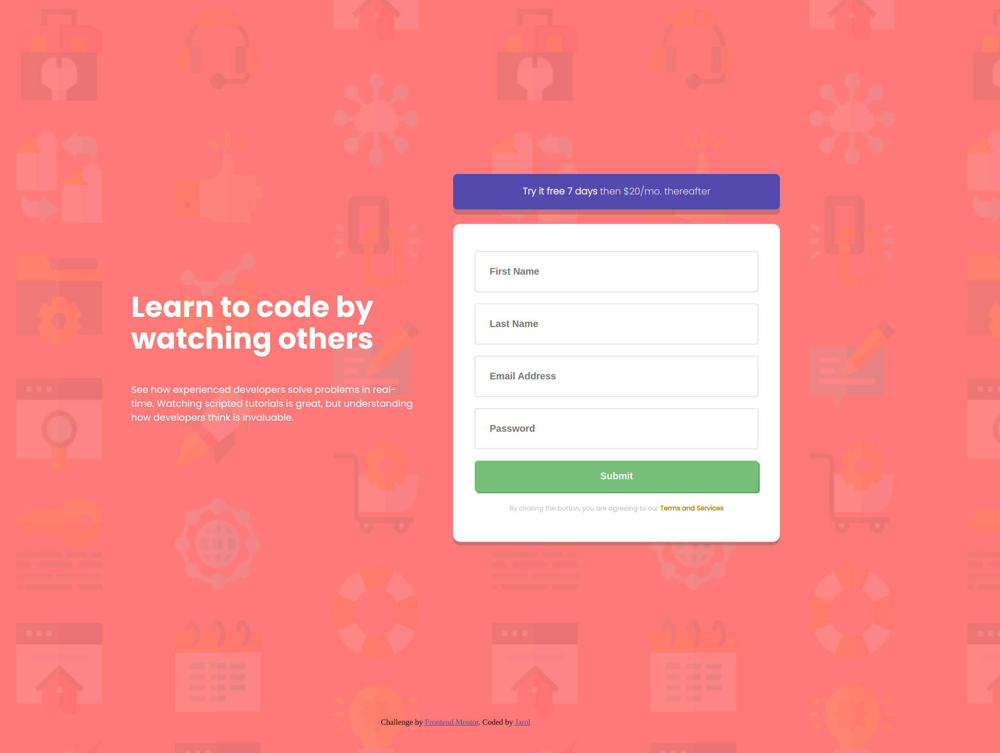
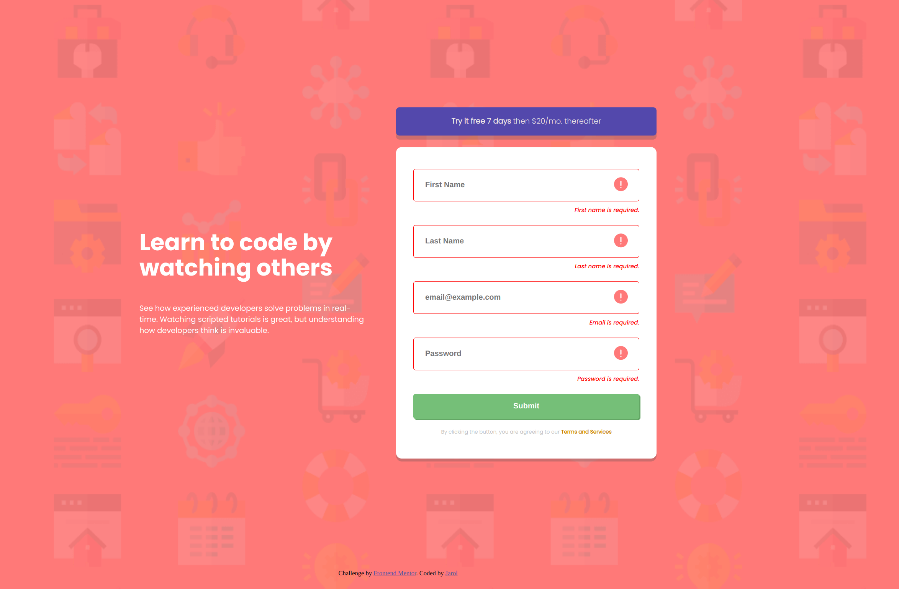
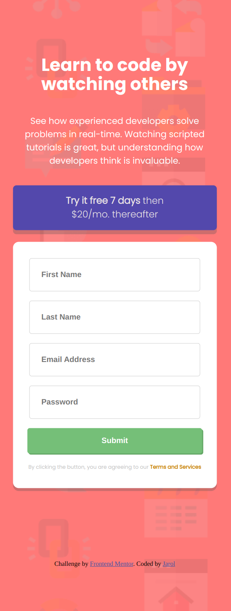
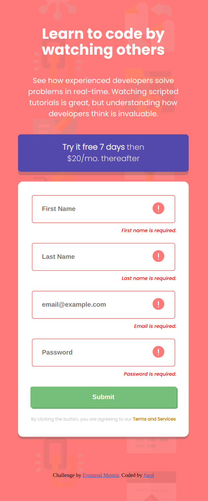

# Frontend Mentor - Intro component with sign up form solution

## Table of contents

- [Overview](#overview)
  - [The challenge](#the-challenge)
  - [Screenshot](#screenshot)
  - [Links](#links)
- [My process](#my-process)
  - [Built with](#built-with)
  - [What I learned](#what-i-learned)
  - [Continued development](#continued-development)
  - [Useful resources](#useful-resources)
- [Author](#author)

## Overview

### The challenge

Users should be able to:

- View the optimal layout for the site depending on their device's screen size
- See hover states for all interactive elements on the page
- Receive an error message when the `form` is submitted if:
  - Any `input` field is empty. The message for this error should say *"[Field Name] cannot be empty"*
  - The email address is not formatted correctly (i.e. a correct email address should have this structure: `name@host.tld`). The message for this error should say *"Looks like this is not an email"*

### Screenshot

### Links

- Live Site URL: [Add live site URL here](https://mirrorinstinct.github.io/Sign-Up-Form-Component/)

## My process

### Built with

- Semantic HTML5 markup
- CSS custom properties
- Javascript
- Flexbox

### What I learned

As simple as this project seemed, it gave me the chance to practice my javascript skills. For example, I haven't had much chance to display text or images when a condition is met or not met. That was a challenging but rewarding part of this project.

### Continued development

Now that I have a better understanding of how to overwrite text or display certain things with Javascript, I can become further efficient in the way that I utilize my code.

### Useful resources

- [Example resource 1](https://www.youtube.com/watch?v=fNcJuPIZ2WE&list=WL&index=2) - Web Dev Simplified is one of the best resources out there for when you want straight forward yet thought provoking answers to parts that you are stuck on. Without his videos, this process would have been much more confusing.

## Author

- Website - [Sign-Up-Form_Component](https://mirrorinstinct.github.io/Sign-Up-Form-Component/)
- Frontend Mentor - [@MirrorInstinct](https://www.frontendmentor.io/home)
